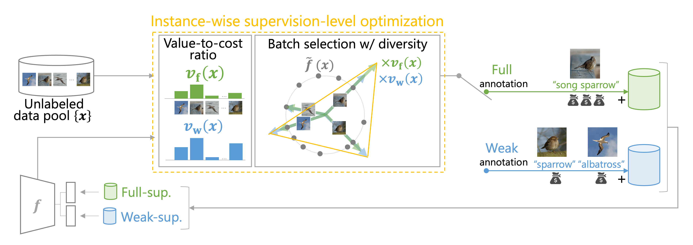

# Instance-wise Supervision-level Optimization in Active Learning [S.Matsuo+, CVPR2025]
Shinnosuke Matsuo, Riku Togashi, Ryoma Bise, Seiichi Uchida, Masahiro Nomura



>Active learning (AL) is a label-efficient machine learning paradigm that focuses on selectively annotating high-value instances to maximize learning efficiency. Its effectiveness can be further enhanced by incorporating weak supervision, which uses rough yet cost-effective annotations instead of exact (i.e., full) but expensive annotations. We introduce a novel AL framework, Instance-wise Supervision-Level Optimization (ISO), which not only selects the instances to annotate but also determines their optimal annotation level within a fixed annotation budget. Its optimization criterion leverages the value-to-cost ratio (VCR) of each instance while ensuring diversity among the selected instances.
In classification experiments, ISO consistently outperforms traditional AL methods and surpasses a state-of-the-art AL approach that combines full and weak supervision, achieving higher accuracy at a lower overall cost.

## Requirements
* python >= 3.9
* cuda && cudnn
```
# pytorch install (https://pytorch.org/get-started/locally/)
$ pip3 install torch torchvision torchaudio --index-url https://download.pytorch.org/whl/cu118
$ pip install -r requirements.txt
```

## Training & Test
```
$ python src/run.py --dataset='cifar100' --num_rounds=5 --budget=1000 --cost_weak=0.5 --output_dir='result/'
```

## Arguments
You can set up any parameters at `arguments.py`

## Citation
If you find this repository helpful, please consider citing:
```
@inproceedings{matsuo2025isoal,
  title = {Instance-wise Supervision-level Optimization in Active Learning},
  author = {Shinnosuke Matsuo and Riku Togashi and Ryoma Bise and Seiichi Uchida and Masahiro Nomura},
  booktitle={Computer Vision and Pattern Recognition},
  year = {2025},
}
```